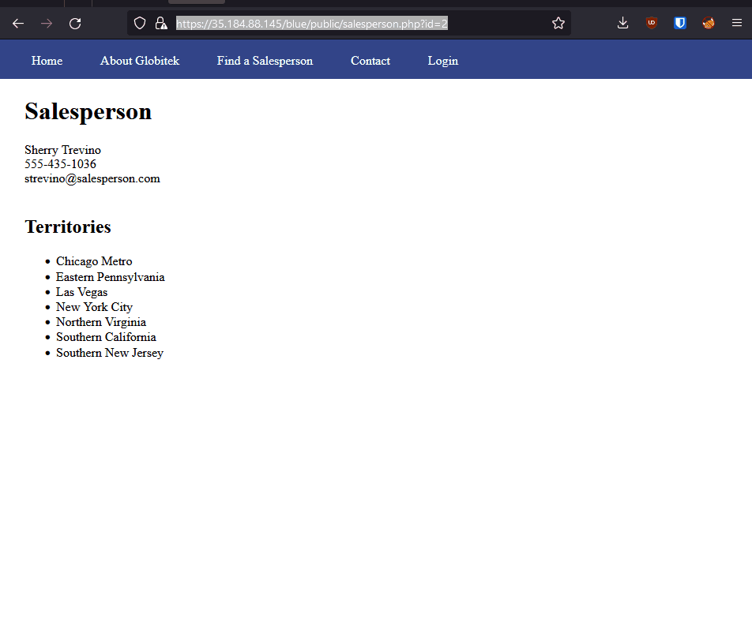
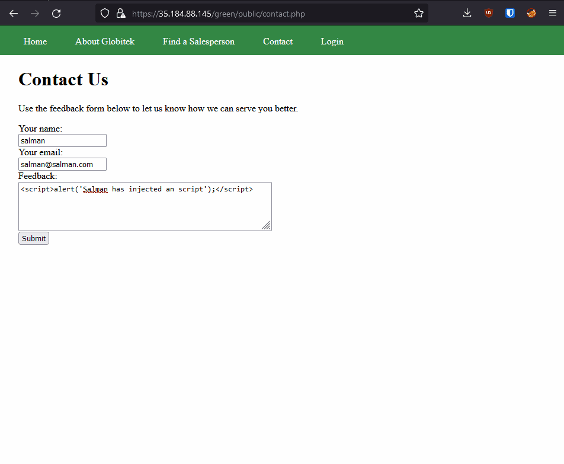

# sbarry2020_Unit-9-Project-Pen-Testing-Live-Targets
Unit 9 Project: Pen Testing Live Targets
# Pen Testing Live Targets

Time spent: **3** hours spent in total

> Objective: Identify vulnerabilities in three different versions of the Globitek website: blue, green, and red.

The six possible exploits are:

* Username Enumeration
* Insecure Direct Object Reference (IDOR)
* SQL Injection (SQLi)
* Cross-Site Scripting (XSS)
* Cross-Site Request Forgery (CSRF)
* Session Hijacking/Fixation

Each color is vulnerable to only 2 of the 6 possible exploits. First discover which color has the specific vulnerability, then write a short description of how to exploit it, and finally demonstrate it using screenshots compiled into a GIF.

## Blue

Vulnerability #1: SQL Injection

Description: The attacker can enter any sql script in the id field in the url, allowing the attacker to take control of any of the forms data, and pull it at will without admin provelages, the code ```%27%20OR%20SLEEP(10)=0--%27``` will delay the request by 10 seconds




## Green

Vulnerability #1: Cross-Site Scripting

Description: A attacker can use the feedback form to inject a script, by simply using ```<script> "Salman has inserted a script" </script>```, once an admin clicks on the feedback form the script will be activated.



Vulnerability #2: User Enumaration

Description: When the user name is correct the "log in is unsucessfull" messege is bolded and when the user doesnt exist it is plain text, the creator of the site forgot to use the same fomrat for both possibilities


## Red

Vulnerability #1: Insecure Direct Object Reference

Description: If user edits the useris they can access information that the admin has decided to make private, as shown in the example, despite lazy lazyman not being listed, i can find him by changing the user id to 11


## Notes

Describe any challenges encountered while doing the work
